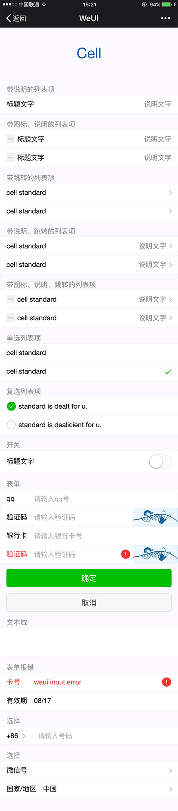
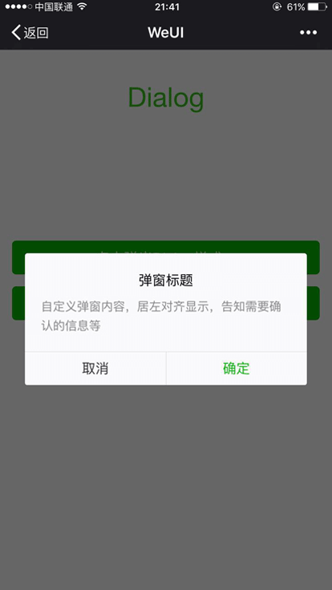
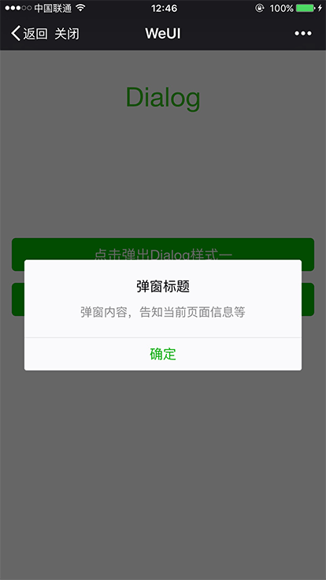
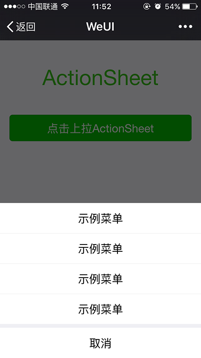
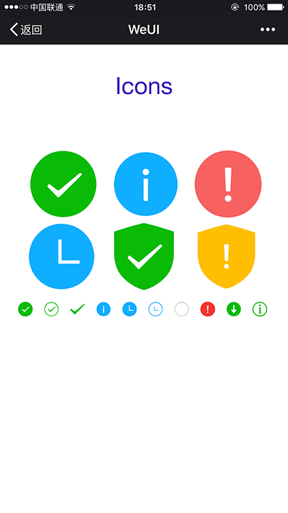

WeUI 为微信 Web 服务量身设计  
====

## 概述

WeUI是一套同微信原生视觉体验一致的基础样式库，由微信官方设计团队为微信 Web 开发量身设计，可以令用户的使用感知更加统一。包含`button`、`cell`、`dialog`、 `progress`、 `toast`、`article`、`icon`等各式元素。

## 使用

#### 方法一：
使用`bower`进行安装
```
bower install --save weui
```

#### 方法二：
使用`npm`进行安装
```
npm install --save weui
```

以上两种方法安装后，只需要在页面中引入`dist/style/weui.css`或者`dist/style/weui.min.css`其中之一即可. 例如:

```html
<!DOCTYPE html>
<html lang="en">
    <head>
        <meta charset="UTF-8">
        <meta name="viewport" content="width=device-width,initial-scale=1,user-scalable=0">
        <title>WeUI</title>
        <link rel="stylesheet" href="path/to/weui/dist/style/weui.min.css"/>
    </head>
    <body>
    
    </body>
</html>
```

## 开发

```
git clone https://github.com/weui/weui.git
cd weui
npm install -g gulp
npm install
gulp -ws
```
运行`gulp -ws`命令，会监听`src`目录下所有文件的变更，并且默认会在`8080`端口启动服务器，然后在浏览器打开 `http://localhost:8080/example`。


## 手机预览

请用微信扫码


[http://weui.github.io/weui/](http://weui.github.io/weui)


## 第三方扩展

- [kevyu/weui-sass](https://github.com/kevyu/weui-sass)
- [Eric-Guo/weui-rails](https://github.com/Eric-Guo/weui-rails)(Using kevyu/weui-sass)
- [n7best/react-weui](https://github.com/n7best/react-weui)
- [aidenzou/vue-weui](https://github.com/aidenzou/vue-weui)
- [ZTfer/weui-sketch](https://github.com/ZTfer/weui-sketch)

## Button

按钮可以使用`a`或者`button`标签。wap上要触发按钮的active态，必须触发ontouchstart事件，可以在`body`上加上`ontouchstart=""`全局触发。

按钮常见的操作场景：确定、取消、警示，分别对应class：`weui_btn_primary`、`weui_btn_default`、`weui_btn_warn`，每种场景都有自己的置灰态`weui_btn_disabled`，除此外还有一种镂空按钮`weui_btn_plain_xxx`，客户端webview里的按钮尺寸有两类，默认宽度100%，小型按钮宽度自适应，两边边框与文本间距0.75em：


```html
<a href="javascript:;" class="weui_btn weui_btn_primary">按钮</a>
<a href="javascript:;" class="weui_btn weui_btn_disabled weui_btn_primary">按钮</a>
<a href="javascript:;" class="weui_btn weui_btn_warn">确认</a>
<a href="javascript:;" class="weui_btn weui_btn_disabled weui_btn_warn">确认</a>
<a href="javascript:;" class="weui_btn weui_btn_default">按钮</a>
<a href="javascript:;" class="weui_btn weui_btn_disabled weui_btn_default">按钮</a>
<div class="button_sp_area">
    <a href="javascript:;" class="weui_btn weui_btn_plain_default">按钮</a>
    <a href="javascript:;" class="weui_btn weui_btn_plain_primary">按钮</a>

    <a href="javascript:;" class="weui_btn weui_btn_mini weui_btn_primary">按钮</a>
    <a href="javascript:;" class="weui_btn weui_btn_mini weui_btn_default">按钮</a>
</div>
```


## Cell

`Cell`，列表视图，用于将信息以列表的结构显示在页面上，是wap上最常用的内容结构。`Cell`由多个section组成，每个section包括section header`weui_cells_title`以及cells`weui_cells`。

`cell`由thumbnail`weui_cell_hd`、body`weui_cell_bd`、accessory`weui_cell_ft`三部分组成，`cell`采用自适应布局，在需要自适应的部分加上class`weui_cell_primary`即可：



带说明的列表项

```html
<div class="weui_cells_title">带说明的列表项</div>
<div class="weui_cells">
    <div class="weui_cell">
        <div class="weui_cell_bd weui_cell_primary">
            <p>标题文字</p>
        </div>
        <div class="weui_cell_ft">
            说明文字
        </div>
    </div>
</div>
```

`Cell`可根据需要进行各种自定义扩展，包括辅助说明、跳转、单选、复选等。下面以带图标、说明、跳转的列表项，其他情况可以直接参考`example`下的代码：

```html
<div class="weui_cells_title">带图标、说明、跳转的列表项</div>
<div class="weui_cells weui_cells_access">

    <a class="weui_cell" href="javascript:;">
        <div class="weui_cell_hd">
            
        </div>
        <div class="weui_cell_bd weui_cell_primary">
            <p>cell standard</p>
        </div>
        <div class="weui_cell_ft">
            说明文字
        </div>
    </a>
    <a class="weui_cell" href="javascript:;">
        <div class="weui_cell_hd">
            
        </div>
        <div class="weui_cell_bd weui_cell_primary">
            <p>cell standard</p>
        </div>
        <div class="weui_cell_ft">
            说明文字
        </div>
    </a>
</div>
```


## Dialog

若系统的alert窗体无法满足网页的临时视图内容需求，则可以自定义实现与alert形式相似的dialog，并且在dialog中可以自定义地使用各种控件，来满足需求。



```html
<div class="weui_dialog_confirm">
    <div class="weui_mask"></div>
    <div class="weui_dialog">
        <div class="weui_dialog_hd"><strong class="weui_dialog_title">弹窗标题</strong></div>
        <div class="weui_dialog_bd">自定义弹窗内容，居左对齐显示，告知需要确认的信息等</div>
        <div class="weui_dialog_ft">
            <a href="javascript:;" class="weui_btn_dialog default">取消</a>
            <a href="javascript:;" class="weui_btn_dialog primary">确定</a>
        </div>
    </div>
</div>
```


```html
<div class="weui_dialog_alert">
    <div class="weui_mask"></div>
    <div class="weui_dialog">
        <div class="weui_dialog_hd"><strong class="weui_dialog_title">弹窗标题</strong></div>
        <div class="weui_dialog_bd">弹窗内容，告知当前页面信息等</div>
        <div class="weui_dialog_ft">
            <a href="javascript:;" class="weui_btn_dialog primary">确定</a>
        </div>
    </div>
</div>
```

## Progress

progress用于上传、下载等耗时并且需要显示进度的场景，用户可以随时中断该操作。


```html
<div class="weui_progress">
    <div class="weui_progress_bar">
        <div class="weui_progress_inner_bar" style="width: 50%;"></div>
    </div>
    <a href="javascript:;" class="weui_progress_opr">
        <i class="weui_icon_cancel"></i>
    </a>
</div>
```

## Toast

toast用于临时显示某些信息，并且会在数秒后自动消失。这些信息通常是轻量级操作的成功、失败或等待状态信息。


```html
<div id="toast" style="display: none;">
    <div class="weui_mask_transparent"></div>
    <div class="weui_toast">
        <i class="weui_icon_toast"></i>
        <p class="weui_toast_content">已完成</p>
    </div>
</div>
```


```html
<div id="loadingToast" class="weui_loading_toast" style="display:none;">
    <div class="weui_mask_transparent"></div>
    <div class="weui_toast">
        <div class="weui_loading">
            <!-- :) -->
            <div class="weui_loading_leaf weui_loading_leaf_0"></div>
            <div class="weui_loading_leaf weui_loading_leaf_1"></div>
            <div class="weui_loading_leaf weui_loading_leaf_2"></div>
            <div class="weui_loading_leaf weui_loading_leaf_3"></div>
            <div class="weui_loading_leaf weui_loading_leaf_4"></div>
            <div class="weui_loading_leaf weui_loading_leaf_5"></div>
            <div class="weui_loading_leaf weui_loading_leaf_6"></div>
            <div class="weui_loading_leaf weui_loading_leaf_7"></div>
            <div class="weui_loading_leaf weui_loading_leaf_8"></div>
            <div class="weui_loading_leaf weui_loading_leaf_9"></div>
            <div class="weui_loading_leaf weui_loading_leaf_10"></div>
            <div class="weui_loading_leaf weui_loading_leaf_11"></div>
        </div>
        <p class="weui_toast_content">数据加载中</p>
    </div>
</div>
```

## Msg Page

结果页通常来说可以认为进行一系列操作步骤后，作为流程结束的总结性页面。结果页的作用主要是告知用户操作处理结果以及必要的相关细节（可用于确认之前的操作是否有误）等信息；若该流程用于开启或关闭某些重要功能，可在结果页增加与该功能相关的描述性内容；除此之外，结果页也可以承载一些附加价值操作，例如提供抽奖、关注公众号等功能入口。


```html
<div class="weui_msg">
    <div class="weui_icon_area"><i class="weui_icon_success weui_icon_msg"></i></div>
    <div class="weui_text_area">
        <h2 class="weui_msg_title">操作成功</h2>
        <p class="weui_msg_desc">内容详情，可根据实际需要安排</p>
    </div>
    <div class="weui_opr_area">
        <p class="weui_btn_area">
            <a href="javascript:;" class="weui_btn weui_btn_primary">确定</a>
            <a href="javascript:;" class="weui_btn weui_btn_default">取消</a>
        </p>
    </div>
    <div class="weui_extra_area">
        <a href="">查看详情</a>
    </div>
</div>
```

## Article

文字视图显示大段文字，这些文字通常是页面上的主体内容。`Article`支持分段、多层标题、引用、内嵌图片、有/无序列表等富文本样式，并可响应用户的选择操作。

在微信客户端webview中使用`Article`，必须保证文字有足够的可读性和可辨识性、使用规范字体、保证足够的段间距、段首无缩进。


```html
<article class="weui_article">
    <h1>大标题</h1>
    <section>
        <h2 class="title">章标题</h2>
        <section>
            <h3>1.1 节标题</h3>
            <p>Lorem ipsum dolor sit amet, consectetur adipisicing elit, sed do eiusmod
                tempor incididunt ut labore et dolore magna aliqua. Ut enim ad minim veniam,
                quis nostrud exercitation ullamco laboris nisi ut aliquip ex ea commodo
                consequat. Duis aute</p>
        </section>
        <section>
            <h3>1.2 节标题</h3>
            <p>Lorem ipsum dolor sit amet, consectetur adipisicing elit, sed do eiusmod
                tempor incididunt ut labore et dolore magna aliqua. Ut enim ad minim veniam,
                cillum dolore eu fugiat nulla pariatur. Excepteur sint occaecat cupidatat non
                proident, sunt in culpa qui officia deserunt mollit anim id est laborum.</p>
        </section>
    </section>
</article>
```
## ActionSheet
`ActionSheet`用于显示包含一系列可交互的动作集合，包括说明、跳转等。由底部弹出，一般用于响应用户对页面的点击。



```html
<div id="actionSheet_wrap">
    <div class="weui_mask_transition" id="mask"></div>
    <div class="weui_actionsheet" id="weui_actionsheet">
        <div class="weui_actionsheet_menu">
            <div class="weui_actionsheet_cell">示例菜单</div>
            <div class="weui_actionsheet_cell">示例菜单</div>
            <div class="weui_actionsheet_cell">示例菜单</div>
            <div class="weui_actionsheet_cell">示例菜单</div>
        </div>
        <div class="weui_actionsheet_action">
            <div class="weui_actionsheet_cell" id="actionsheet_cancel">取消</div>
        </div>
    </div>
</div>
```

## Icon


```html
<i class="weui_icon_msg weui_icon_success"></i>
<i class="weui_icon_msg weui_icon_info"></i>
<i class="weui_icon_msg weui_icon_warn"></i>
<i class="weui_icon_msg weui_icon_waiting"></i>
<i class="weui_icon_safe weui_icon_safe_success"></i>
<i class="weui_icon_safe weui_icon_safe_warn"></i>
<div class="icon_sp_area">
    <i class="weui_icon_success"></i>
    <i class="weui_icon_success_circle"></i>
    <i class="weui_icon_success_no_circle"></i>
    <i class="weui_icon_info"></i>
    <i class="weui_icon_waiting"></i>
    <i class="weui_icon_waiting_circle"></i>
    <i class="weui_icon_circle"></i>
    <i class="weui_icon_warn"></i>
    <i class="weui_icon_download"></i>
    <i class="weui_icon_info_circle"></i>
    <i class="weui_icon_cancel"></i>
</div>
```

## TODO

- 更多的组件
- react-weui

## License
The MIT License(http://opensource.org/licenses/MIT)
请自由地享受和参与开源

## 贡献

如果你有好的意见或建议，欢迎给我们提issue或pull request，为提升微信web体验贡献力量
